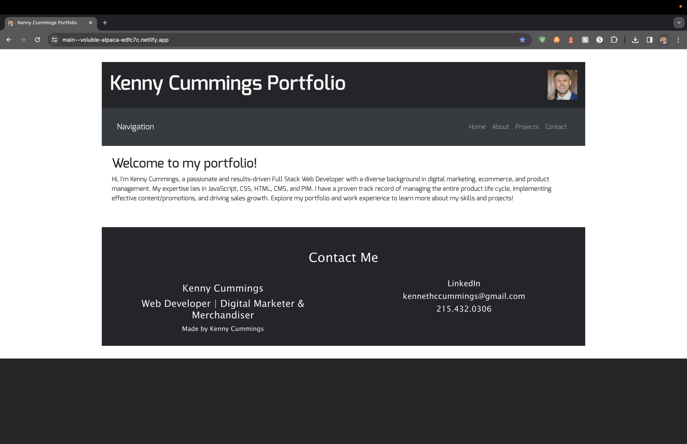

# Kenny Cummings Work Portfolio

## Purpose

The Kenny Cummings Work Portfolio is a showcase of Kenny Cummings' skills, projects, and work experiences. It provides visitors with insights into his background, expertise in web development, and a glimpse into his projects.

## Features and Functionality

- **Home Page:** Introduces visitors to the portfolio and provides a brief overview of Kenny Cummings' skills and passion for web development.

- **About Me:** Offers a detailed description of Kenny Cummings' background, including his experience in web development, digital marketing, ecommerce, product management, and category management.

- **Projects:** Showcases web development projects, including "Round on Me," a golfer meet-up app, and "Your Nutrition Radar," a diet and nutrition app.

- **Contact:** Displays contact information, allowing visitors to connect with Kenny Cummings via LinkedIn, email, or phone.

- **Navigation:** Includes a navigation bar for easy access to different sections of the portfolio.

- **Footer:** Features a footer with a credit line indicating that the portfolio was made by Kenny Cummings.

## Styling

The portfolio incorporates a clean and modern design with a consistent color scheme and responsive layout. The use of Flexbox ensures proper alignment and spacing.

## License

This project is licensed under the [MIT License](LICENSE).

## Deployment Link

https://main--voluble-alpaca-edfc7c.netlify.app/

## Screenshot

